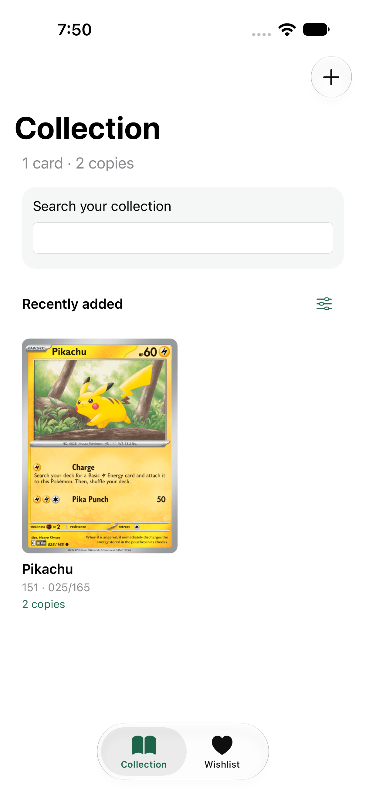
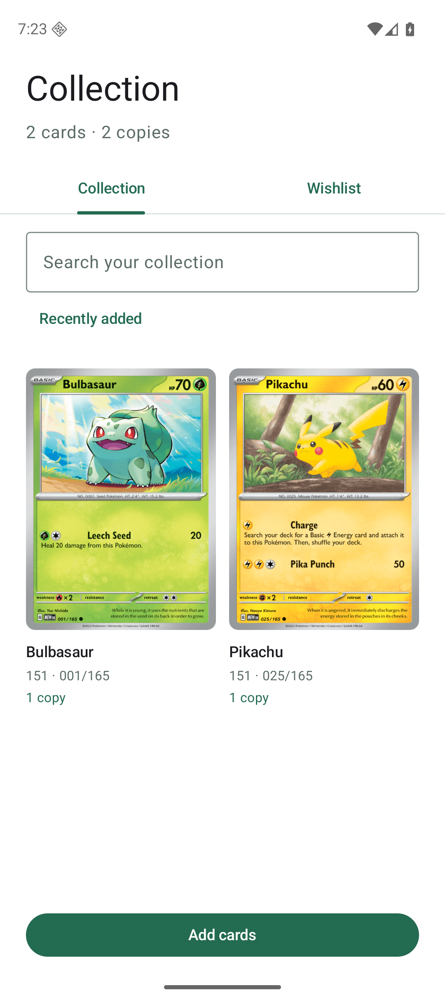

# Pokémon Collection — native example

A small offline collection and wishlist app implemented in SwiftUI and Jetpack Compose from the [Figma collection designs](https://www.figma.com/design/cCvOm5AHDpUjPgUlYnzuoO/?node-id=0-1).

This example lives beside the reusable starter. The projects in `apps/android/` and `apps/ios/` still launch the environment-configuration template. The example uses its own application identity, build output, and saved data; it consumes the existing native design libraries without changing them.

<p>
  
  
</p>

Native screenshots from verification, populated through the app's add-copy flow. First launch starts empty.

## Try the example

Use the repository's [native toolchain prerequisites](../../docs/architecture/toolchains.md). Clone the whole repository: the example references its corresponding native design library elsewhere in the checkout.

**Android:** Open `examples/pokemon-collection/android/` in Android Studio. Select the `app` run configuration and an emulator/device. From this directory, `./gradlew :app:assembleDebug` builds a debug APK at `app/build/outputs/apk/debug/app-debug.apk`.

**iOS:** Open `examples/pokemon-collection/ios/PokemonCollection.xcodeproj` in Xcode. Select the shared `PokemonCollection` scheme and an iOS simulator, then Run. Simulator builds require no personal development team. Physical-device signing is a local Xcode choice.

The example starts empty. Tap **Find a card** / the add action, search for **Pikachu** or **25**, open its details, and add copies. Choose a finish and condition, optionally record a note, and save. Changes remain after closing and reopening the app. Save a card to Wishlist independently of whether it is owned. Open a saved entry's delete action and confirm to remove that entry.

The catalog is intentionally limited to the seven cards shown in the Figma study. Search accepts names, the set name `151`, and printed card numbers. Collection and wishlist searches only include saved cards. Sorting supports recent, name, and card number. The example contains no pricing, live catalog service, authentication, cloud sync, or scanning.

## Verify

Run these commands from the repository root:

```sh
./tooling/scripts/doctor android
./tooling/scripts/doctor ios
./examples/pokemon-collection/scripts/verify assets
./examples/pokemon-collection/scripts/verify android
./examples/pokemon-collection/scripts/verify ios
```

`verify all` attempts asset checks and both native verifications. Asset checks use Python 3's standard library. Android verification builds Debug and Release, runs lint, and executes feature state/persistence and Compose interaction tests. iOS verification builds and runs its unit/UI tests on an automatically managed dedicated simulator and builds Release. Platform scripts retain ignored logs and report failures through their exit status.

The root template commands and its existing GitHub Actions workflow verify the template, not this example. Run the example commands when modifying example code. Successful compilation, executed tests, native screenshots, accessibility audits, and physical-device testing are separate evidence; see each platform's `VERIFICATION.md` and the [combined evidence](../../docs/workflows/pokemon-example-verification-2026-09-22.md).

## Structure

```text
pokemon-collection/
├── android/     Independent Gradle app and collection feature
├── ios/         Independent Xcode app and collection feature package
├── assets/      Shared static catalog and bundled card PNGs
├── scripts/     Example-only verification entry point
└── tests/       Static catalog and artwork checks
```

Only static card content is shared. Neither native build invokes the other platform. Each feature owns its state, validation, persistence, and screens; each app assembles dependencies. The app IDs are `com.example.pokemoncollection`, distinct from all template environments. User data stays in each app's private storage. Storage errors are surfaced rather than silently replacing a saved collection.

See the [feature specification](../../docs/specs/2026-09-22-pokemon-collection-example.md), [isolation decision](../../docs/decisions/0003-isolated-pokemon-example.md), and [artwork attribution](assets/README.md).
